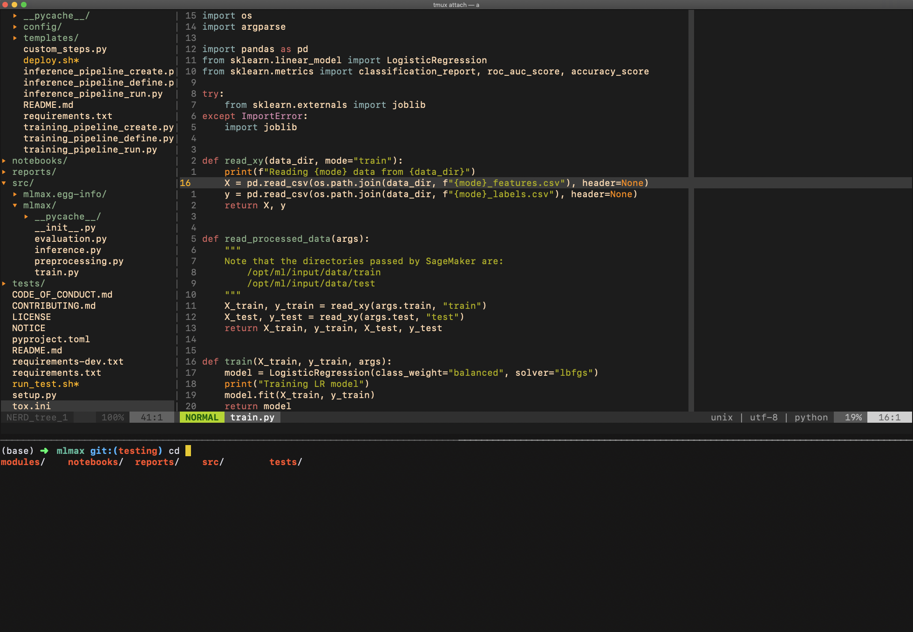
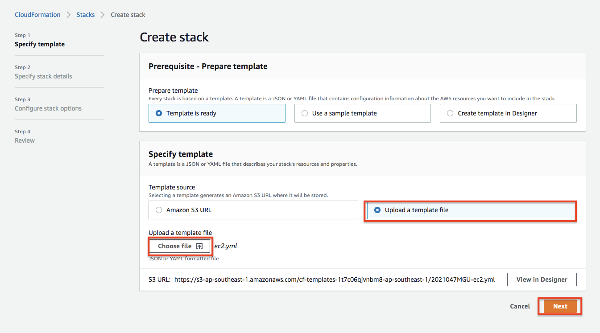
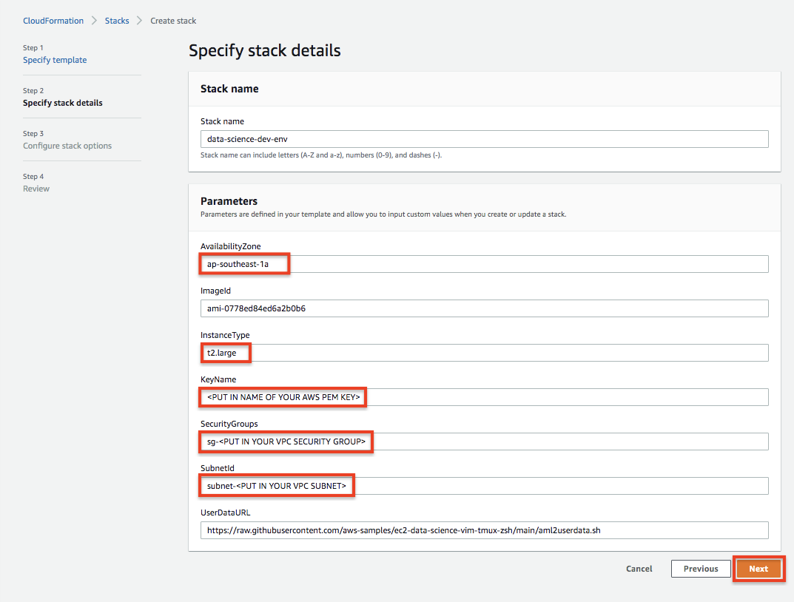
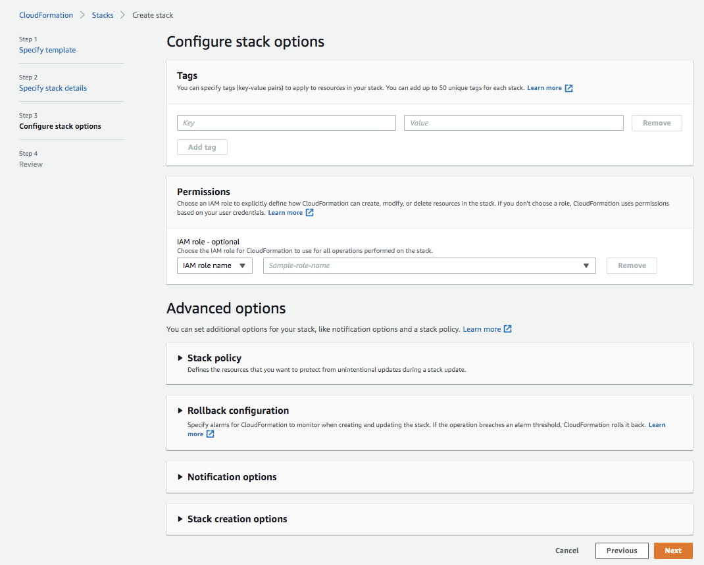
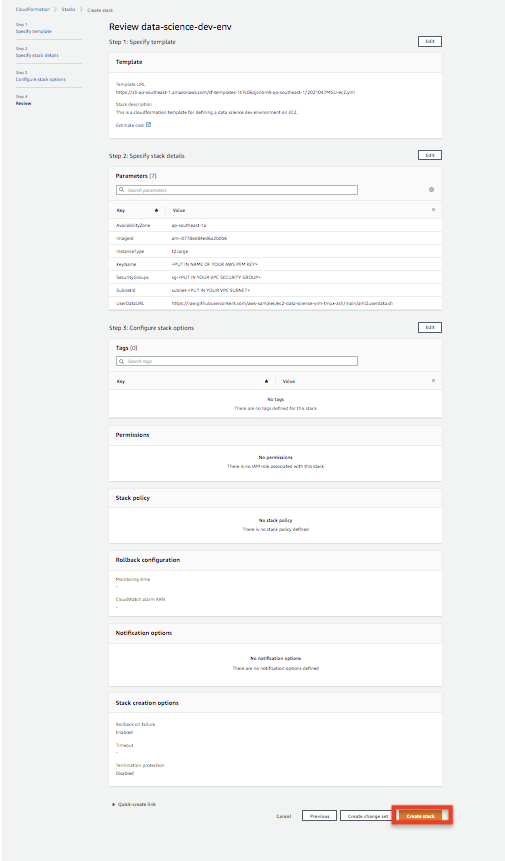

# Simple setup Data Science development with tmux, zsh, and vim

A simple guide to setting up basic Vim, Tmux, Zsh for the Deep Learning AMI
Amazon Linux 2 and MAC OS for data scientists.

After setting up the environment it should look something like this.

There are three aspects to this setup:
- Edit/navigate and run code in the same window simultaneously using
  [Tmux](https://github.com/tmux/tmux/wiki).
- Develop code with [Vim](https://www.vim.org/), configured with popular
  plugins and sensible defaults.
- Enable directory navigation and display git branch/status with [Oh My
  Zsh](https://ohmyz.sh/).

## Getting started

### Commandline Deployment
> Need modify config/deploy.ini before running your commands

    git clone https://github.com/aws-samples/ec2-data-science-vim-tmux-zsh.git
    cd ec2-data-science-vim-tmux-zsh 
    ./deploy.sh <STACK_NAME> <REGION> <PROFILE>

### One click Deployment

Upload the cloudformation template file at https://github.com/aws-samples/ec2-data-science-vim-tmux-zsh/blob/main/templates/ec2.yml

Input your own parameters

Proceed to create a stack

